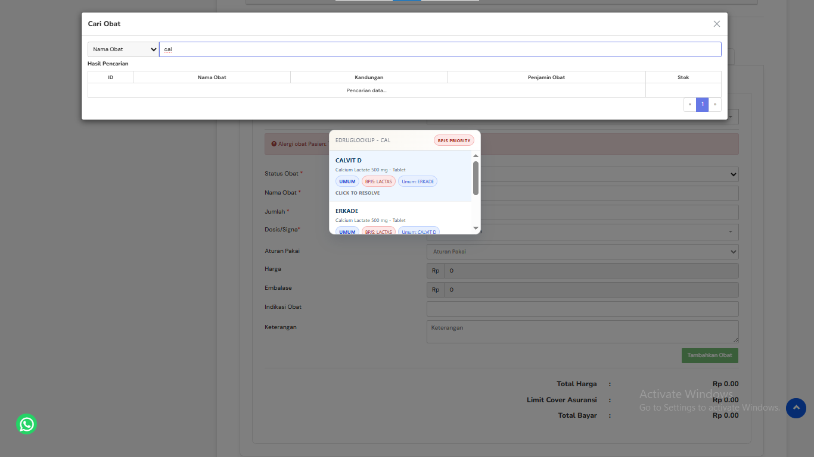
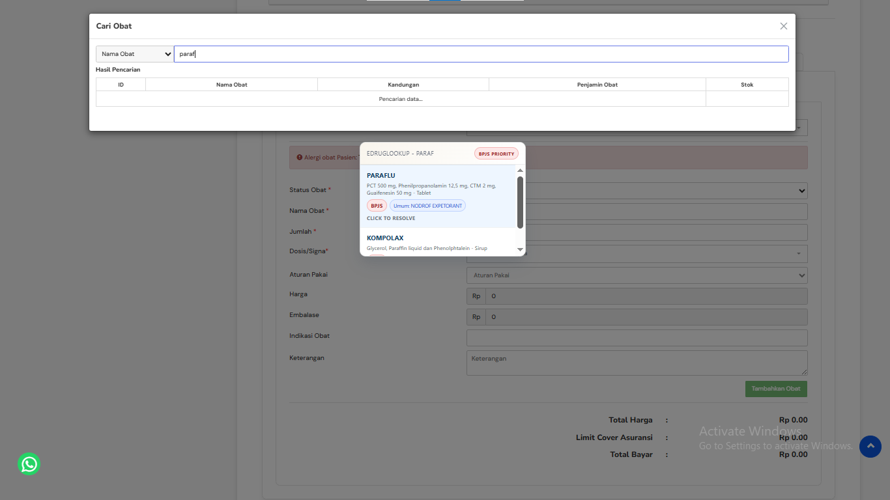

# eDrugLookup


Extension Chromium Manifest V3 untuk membantu drug lookup pada eClinic, khususnya halaman `https://emr.eclinic.id/pemeriksaanmedis/show/*` dan workflow resep `Non Racik`.

Extension ini dirancang untuk tetap native-first: membantu mencari alias obat dari katalog internal, menampilkan prioritas payer pasien, dan membantu resolve ke inventory live di EMR tanpa menekan `Tambahkan Obat`, tanpa menekan `Simpan`, dan tanpa submit resep otomatis.

## Ringkasan

- Lookup lokal berbasis katalog CSV yang bisa disesuaikan
- Support inline field `Nama Obat` dan modal native `Cari Obat`
- Payer badge berbasis `Data Pasien > Penjamin`
- Resolver inventory live lewat bridge ke page context / Vue internal eClinic
- UI dirender di `ShadowRoot` agar tetap terisolasi dari halaman

## Quick Start

```bash
npm install
npm run build
```

Lalu buka `chrome://extensions`, aktifkan `Developer mode`, klik `Load unpacked`, dan pilih folder [`dist/`](./dist).

## Preview

<p align="center">
  
  
</p>

## Fitur Saat Ini

- Lookup lokal dari [LIST OBAT 2026.csv](./LIST%20OBAT%202026.csv)
- Support dua flow:
  - field inline `Nama Obat` pada `Resep > Non Racik`
  - modal native `Cari Obat`
- Suggestion level alias:
  - alias utama tampil sebagai judul
  - sibling alias tampil sebagai pill tambahan
  - alias utama tetap punya badge sumber `BPJS` atau `Umum`
- Infer payer pasien dari `Data Pasien > Penjamin`
- Resolve ke inventory live EMR lewat bridge ke page context / Vue instance
- Modal behavior native-first:
  - tidak takeover `ArrowUp`, `ArrowDown`, atau `Enter`
  - tidak ganggu hasil pencarian native saat user sedang mengetik

## Struktur Proyek

- `src/content/`
  - content script, controller, UI shadow DOM, context detection, payer inference, dan page bridge
- `src/lib/catalog/`
  - normalisasi CSV, pencarian lokal, dan resolver inventory
- `src/generated/catalog.ts`
  - output generated dari CSV, tidak diedit manual
- `scripts/buildCatalog.ts`
  - build-time generator katalog TypeScript dari CSV
- `tests/`
  - unit/integration-style tests untuk catalog, controller, page bridge, payer, page state, dan UI
- `LIST OBAT 2026.csv`
  - source of truth manusia-editable untuk katalog obat

## Dokumentasi

- [Panduan instalasi untuk user biasa](./docs/install-for-users.md)
- [Panduan update katalog dari sumber data eksternal (PDF/Excel)](./docs/update-catalog-from-pdf-excel.md)
- [Panduan smoke test setelah update](./docs/smoke-test-after-update.md)
- [Panduan troubleshooting](./docs/troubleshooting.md)
- [FAQ singkat](./docs/faq.md)
- [Customize Your Drug List](./docs/customize-catalog.md)
- [Release notes](./CHANGELOG.md)

## Cara Menjalankan

### Setup

```bash
npm install
```

### Build production

```bash
npm run build
```

Hasil build akan tersedia di folder `dist/`.

### Load ke Chrome / Edge

1. Buka `chrome://extensions` atau `edge://extensions`
2. Aktifkan `Developer mode`
3. Klik `Load unpacked`
4. Pilih folder [`dist/`](./dist)

Kalau ada perubahan code, lakukan:

1. `npm run build`
2. klik `Reload` pada extension di halaman extensions
3. refresh halaman EMR

### Menjalankan test

```bash
npm test
```

### Development loop

```bash
npm run dev
```

Gunakan ini hanya bila memang butuh loop development. Karena content script dijalankan di `world: MAIN`, beberapa bagian tidak mendapat HMR penuh.

## Alur Data

1. CSV katalog diedit di [LIST OBAT 2026.csv](./LIST%20OBAT%202026.csv)
2. `npm run build:catalog` menjalankan [buildCatalog.ts](./scripts/buildCatalog.ts)
3. Generator menghasilkan [catalog.ts](./src/generated/catalog.ts)
4. Content script bootstrap dari [index.ts](./src/content/index.ts)
5. Controller menjalankan pencarian lokal berbasis alias dan kandungan
6. Jika user memilih suggestion, resolver akan mencari inventory live lewat page bridge
7. Hanya field obat yang diisi; extension tidak menyimpan resep

## Guardrail dan Safety

- Tidak klik `Tambahkan Obat`
- Tidak klik `Simpan`
- Tidak submit form
- Tidak takeover keyboard modal native
- Payer pasien harus dibaca dari row `Penjamin` pada kartu `Data Pasien`
- Modal resolve tidak boleh menggabungkan alias utama dan sibling alias menjadi satu term concatenated

## Known Limitations

- Extension hanya aktif di `https://emr.eclinic.id/pemeriksaanmedis/show/*`
- Extension saat ini fokus pada workflow `Resep > Non Racik` dan modal native `Cari Obat`
- Belum mencakup flow seperti `Racik` atau `Resep ke Luar`
- Sangat bergantung pada DOM, selector, dan Vue internal eClinic
- Perubahan struktur modal, field, atau Vue method di eClinic dapat memutus integrasi
- Infer payer bergantung pada row `Data Pasien > Penjamin`, jadi perubahan label atau layout dapat memengaruhi hasil
- Katalog obat masih berbasis file CSV lokal dan belum sinkron otomatis dengan sumber data eksternal
- Setiap perubahan katalog atau kode tetap memerlukan `npm run build`, reload extension, dan refresh halaman EMR
- Desain extension sengaja native-first, jadi extension tidak menekan `Tambahkan Obat`, tidak menekan `Simpan`, dan tidak submit resep otomatis
- Beberapa error console seperti `$.notify is not a function` berasal dari situs EMR, bukan dari extension ini

## Testing dan Acceptance

Test yang ada saat ini mencakup:

- normalisasi CSV dan split alias
- ranking search lokal
- resolver inventory dan prioritas payer
- context detection inline vs modal
- bridge ke Vue / page context
- behavior controller untuk modal native-first
- layout dan badge UI

Smoke test manual minimum di EMR:

1. buka halaman `pemeriksaanmedis/show/*`
2. masuk ke `Resep`
3. pilih `Non Racik`
4. tes query `paracetamol`
5. tes query `pacd`
6. tes query `cop`
7. pastikan:
   - panel muncul
   - payer badge benar
   - alias gabungan tidak muncul lagi
   - extension tidak klik `Tambahkan Obat` atau `Simpan`

## Roadmap

- support `Racik`
- support `Resep ke Luar`
- opsi update atau replace catalog yang lebih aman
- dokumentasi admin flow untuk refresh katalog tanpa edit code inti
